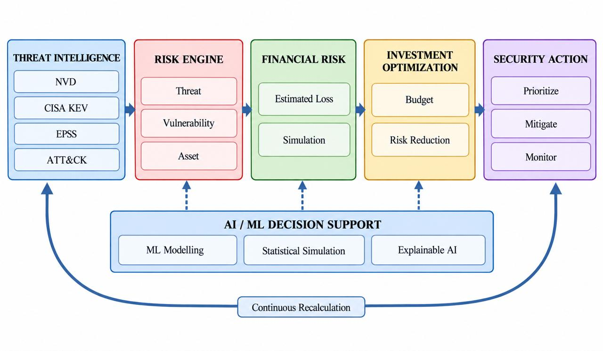

# TRINETRA

### AI-Powered Continuous Cyber Risk Quantification & Investment Optimization Platform

> **SIH26105** &middot; Smart India Hackathon 2026 &middot; Theme: Blockchain & Cybersecurity &middot; Sponsor: AICTE Cyber Security Cell

🚧 **Work in Progress — built for SIH 2026**

---

## The Problem

Organizations face thousands of vulnerabilities but can only fix a few, and CVSS scores tell you how severe a flaw is — not how likely it is to be exploited, which business asset it threatens, or what it would actually cost. Risk assessments are typically a once-a-year PDF, disconnected from the board's financial language, and security budgets get spent on a ranked list instead of an actual investment plan.

**Trinetra turns raw threat data into a continuously updated, board-ready decision: where should the next rupee of security budget go?**

## What Trinetra Does

```
Cyber Threat Intelligence  →  Risk Analysis  →  Financial Risk  →  Investment Optimization  →  Security Action
 (CVE/NVD, KEV, EPSS,          (likelihood ×      (₹ exposure,       budget-constrained          (Fix / Mitigate /
  asset & business context)     exposure)          via Open FAIR)     allocation across controls)   Accept / Transfer)
```

## Key Features

| Feature | What it does |
|---|---|
| **Continuous Risk Quantification** | Risk score recalculates automatically as new CVE, KEV, and EPSS data arrives |
| **Financial Risk Estimation** | Converts findings into an estimated ₹ exposure range, not a single guessed number |
| **Explainable AI** | Plain-language narrative explains why a score changed, with every assumption traceable |
| **Investment Optimization** | Allocates a fixed security budget across controls to maximize risk reduction |
| **What-if Simulation** | Test "cut budget by X%" or "fix this first" before committing real spend |

##  System Architecture

<p align="center">
  
</p>

**Component split:**
- **Deterministic/rule-based:** CVE-to-asset mapping, control-to-risk mapping, budget constraint logic
- **Probabilistic/statistical:** Loss frequency & magnitude distributions, Monte Carlo simulation
- **AI/LLM:** Narrative explanation and board-ready summaries only — never the core ₹ calculation
- **Optimization engine:** LP/integer programming solver for budget allocation

## Tech Stack

| Layer | Technology |
|---|---|
| Frontend | React.js + Tailwind CSS |
| Backend | Python (FastAPI) |
| AI/ML | LLM API (explanation, asset-to-CVE mapping) + scikit-learn/PyMC |
| Database | PostgreSQL + Redis |
| Optimization | SciPy / PuLP |
| Deployment | Docker, cloud free-tier (AWS/GCP/Azure) |

## Data Sources

| Source | Provides | Access |
|---|---|---|
| [NVD](https://nvd.nist.gov) | CVE details, CVSS, CWE, CPE | Public / free (API) |
| [CISA KEV](https://www.cisa.gov/known-exploited-vulnerabilities-catalog) | Confirmed actively-exploited CVEs | Public / free |
| [FIRST EPSS](https://www.first.org/epss) | Probability of exploitation (next 30 days) | Public / free (API) |
| [MITRE ATT&CK](https://attack.mitre.org) | Adversary tactics/techniques mapping | Public / free |
| Synthetic org/asset data | Fills the gap where real enterprise asset & financial data is private | Self-generated, clearly labeled as illustrative |

## Project Structure

```
TRINETRA/
├── Backend-riskEngine/        # PRIMARY UNIFIED BACKEND APPLICATION
│   ├── main.py                # Primary FastAPI application entrypoint
│   ├── config.py              # Centralized environment & intelligence configuration
│   ├── api/                   # Unified API route definitions (/vulnerabilities, /ingestion)
│   ├── ingestion/             # Ingestion orchestration, scheduler, and telemetry tracker
│   ├── integrations/          # External threat intelligence clients (NVD, EPSS, CISA KEV, MITRE)
│   ├── validation/            # Strict schema bounds and CVE format validators
│   ├── normalization/         # Threat record normalization into canonical risk engine payloads
│   ├── cache/                 # 2-Tier memory LRU & persistent SQLite WAL cache
│   ├── risk/                  # Risk Engine core calculation & routers (/risk)
│   ├── financial_crq/         # Financial CRQ / Open FAIR magnitude calculation (/financial-crq)
│   ├── monte_carlo/           # Probabilistic Monte Carlo loss simulation (/monte-carlo)
│   ├── schemas/               # Threat intelligence & vulnerability data schemas
│   └── tests/                 # Comprehensive test suite (95 tests)
├── Backend-input/             # Synthetic asset data generator & standalone input schemas
├── Backend-integration/       # Standalone ingestion reference implementation
├── Frontend/                  # React + Tailwind dashboard
├── Assets/                    # Architecture diagrams and design assets
└── README.md
```

## Getting Started

### Prerequisites
- Python 3.11+ (tested on Python 3.13)
- Node.js 18+ (for Frontend)

### Running the Primary Unified Backend (`Backend-riskEngine`)

```bash
# Navigate to Backend-riskEngine
cd Backend-riskEngine

# Create and activate virtual environment (optional)
python -m venv venv
# Windows:
.\venv\Scripts\activate
# Linux/macOS:
# source venv/bin/activate

# Install dependencies
pip install -r requirements.txt

# Start the unified backend server
uvicorn main:app --reload --port 8000
```

The unified backend will be available at:
- **Root Overview & Registered Endpoints:** `http://localhost:8000/`
- **Interactive OpenAPI Documentation:** `http://localhost:8000/docs`
- **Health Check:** `http://localhost:8000/health`

### Unified API Route Groups

| Module | Route Prefix | Key Endpoints | Description |
|---|---|---|---|
| **System** | `/` | `GET /`, `GET /health` | System metadata & multi-module health status |
| **Threat Ingestion** | `/vulnerabilities`, `/ingestion` | `GET /vulnerabilities/{cve_id}`, `POST /vulnerabilities/asset-join`, `POST /ingestion/sync` | Threat intelligence ingestion, enrichment, caching, and asset joining |
| **Risk Engine** | `/risk` | `POST /risk/calculate`, `GET /risk/health` | Deterministic risk score calculation (0–100) & risk tiers |
| **Financial CRQ** | `/financial-crq` | `POST /financial-crq/calculate`, `GET /financial-crq/health` | Open FAIR financial loss magnitude & Expected Annual Loss (₹ EAL) |
| **Monte Carlo** | `/monte-carlo` | `POST /monte-carlo/simulate`, `POST /monte-carlo/simulate-from-crq` | Probabilistic loss distributions, percentiles (P50/P90/P95/P99), and histograms |

### Running Tests

```bash
# Unified Backend test suite (95 tests)
cd Backend-riskEngine
python -m pytest tests -v

# Legacy subpackage test suites
python -m pytest risk/tests.py financial_crq/tests.py monte_carlo/tests.py -v
```

## Roadmap

```
SIH MVP → Enterprise Integration (real asset inventory/CMDB, SIEM)
        → Multi-Organization (MSSP/insurer view across clients)
        → Government / Critical Infrastructure (sector-wide risk visibility)
```

## Team


## References

- [NIST Cybersecurity Framework](https://www.nist.gov/cyberframework)
- [NIST SP 800-30 Rev.1 — Guide for Conducting Risk Assessments](https://csrc.nist.gov/pubs/sp/800/30/r1/final)
- [Open FAIR, The Open Group / FAIR Institute](https://www.fairinstitute.org/about)
- Tsiodra, Panda, Chronopoulos & Panaousis, *"Cyber Risk Assessment and Optimization,"* IEEE Access, 2023 — [doi.org/10.1109/ACCESS.2023.3272670](https://doi.org/10.1109/ACCESS.2023.3272670)

## License

No license has been selected yet. For a hackathon/academic project, [MIT](https://choosealicense.com/licenses/mit/) is a common default — add a `LICENSE` file once the team decides.

## Acknowledgments

Built on public data and standards from NIST, CISA, FIRST.org, MITRE, and The Open Group / FAIR Institute.
